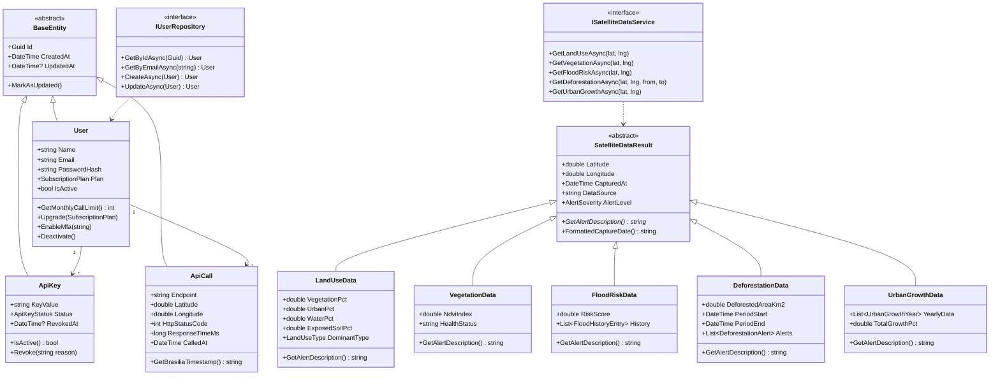
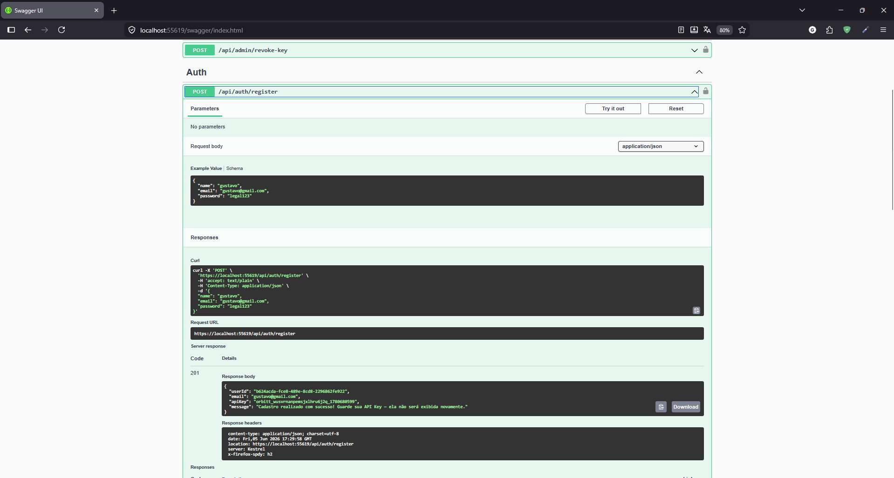
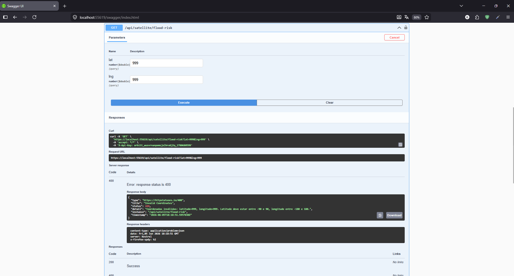
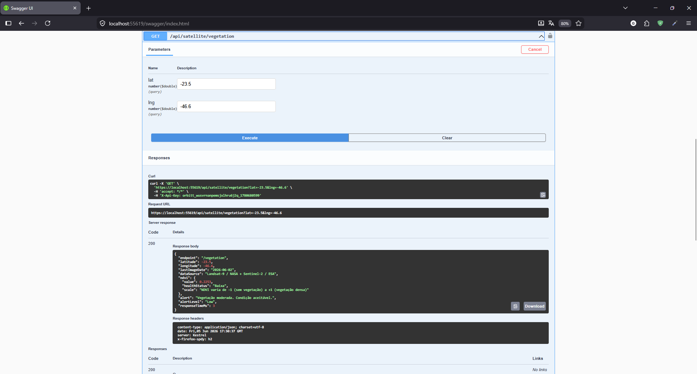
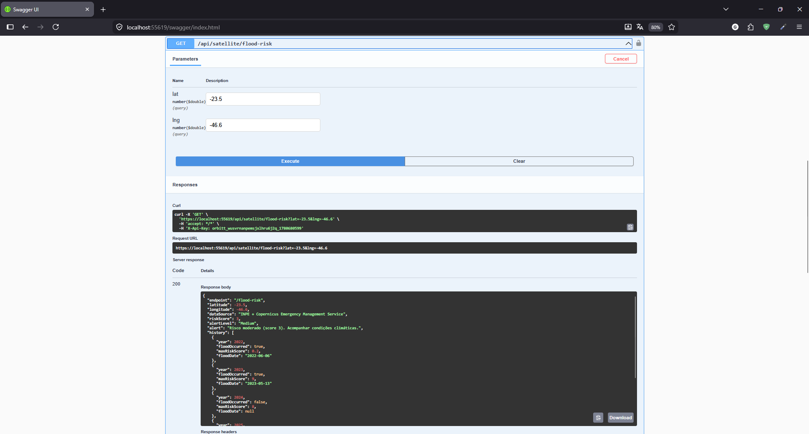
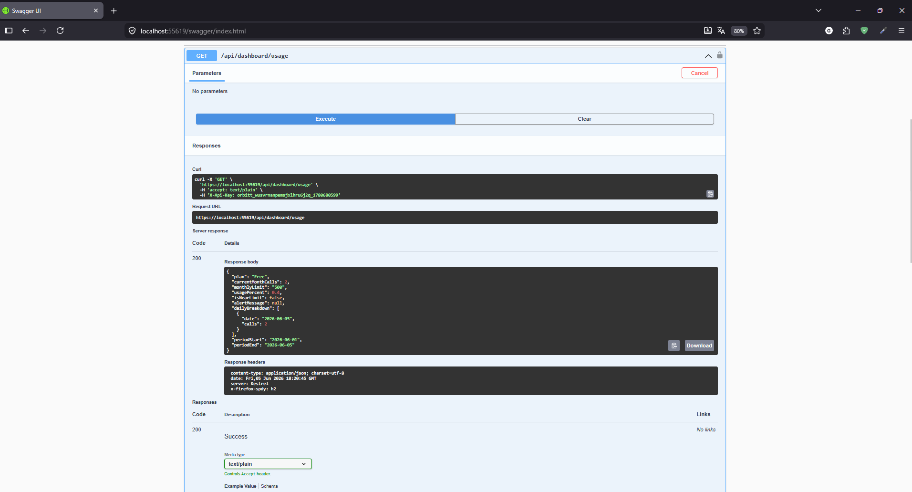

# 🛰️ OrbittAPI

> Plataforma SaaS de acesso a dados satelitais — FIAP Global Solution 2026 · Disciplina C#

## 📋 Descrição

A **OrbittAPI** é uma API REST em .NET 8 que democratiza o acesso à inteligência espacial. Empresas de qualquer setor — agronegócio, seguradoras, construtoras, consultorias ambientais — consomem dados de satélite via endpoints simples, sem precisar de cientistas de dados ou infraestrutura própria.

A plataforma agrega dados simulados de fontes como **NASA, ESA e INPE**, processa métricas prontas para uso e as entrega via API com modelo de assinatura (Free → Startup → Business → Enterprise).

## 👥 Integrantes

| Nome Completo | RM |
|---|---|
| Giovanne Charelli Zaniboni Silva | RM556223 |
| Leonardo Pasquini Baldaia | RM557416 |
| Gustavo Oliveira de Moura | RM555827 |
| Lynn Bueno Rosa | RM551102 |

## 🌍 Motivação e Conexão com o Tema Espacial / ODS

A economia espacial está crescendo. Satélites hoje monitoram florestas, cidades e lavouras com precisão de metros — mas esse poder é acessível apenas para grandes organizações com equipes técnicas especializadas.

A **OrbittAPI** resolve esse problema sendo uma camada de abstração: o cliente faz uma chamada REST simples com coordenadas e recebe métricas prontas (NDVI, risco de alagamento, uso do solo, desmatamento, crescimento urbano).

**ODS conectados:**
- 🌱 **ODS 2** — Fome zero: monitoramento agrícola com NDVI
- ⚙️ **ODS 9** — Inovação e infraestrutura: API como infraestrutura digital espacial  
- 🏙️ **ODS 11** — Cidades sustentáveis: análise de expansão urbana
- 🌡️ **ODS 13** — Ação climática: previsão de riscos de alagamento e desmatamento

## 🛠️ Tecnologias Utilizadas

| Tecnologia | Uso |
|---|---|
| **.NET 8 (ASP.NET Core Web API)** | Framework principal |
| **Entity Framework Core 8** | ORM e mapeamento de banco |
| **SQL Server / InMemory** | Banco de dados (prod / dev) |
| **JWT Bearer** | Autenticação de usuários |
| **BCrypt.Net** | Hash de senhas |
| **Swashbuckle (Swagger)** | Documentação interativa da API |

## 🗂️ Estrutura de Pastas

```
OrbittAPI/
├── Controllers/          # Endpoints REST (AuthController, SatelliteController, etc.)
├── Domain/
│   ├── Entities/         # Entidades de domínio (User, ApiKey, SatelliteData...)
│   ├── Interfaces/       # Contratos (IUserRepository, ISatelliteDataService...)
│   └── Enums/            # Enumerações (SubscriptionPlan, AlertSeverity...)
├── Application/
│   ├── Services/         # Lógica de negócio (SatelliteDataService, AuthService)
│   └── DTOs/             # Objetos de transferência de dados
├── Infrastructure/
│   ├── Data/             # DbContext (EF Core)
│   └── Repositories/     # Implementações dos repositórios
├── Middleware/           # GlobalExceptionMiddleware, ApiKeyMiddleware
├── Exceptions/           # Exceções de domínio customizadas
└── Program.cs            # Entry point e configuração de DI
```

## 🏃 Instruções de Execução

### Pré-requisitos
- [.NET 8 SDK](https://dotnet.microsoft.com/download/dotnet/8.0)
- (Opcional) SQL Server — sem ele, a API roda com banco InMemory automaticamente

### Rodando localmente

```bash
# 1. Clone o repositório
git clone https://github.com/gumoura82/OrbittAPI.git
cd OrbittAPI

# 2. Restore de pacotes
dotnet restore OrbittAPI/OrbittAPI.csproj

# 3. Execute (modo desenvolvimento com InMemory DB)
dotnet run --project OrbittAPI/OrbittAPI.csproj

# 4. Acesse o Swagger
# https://localhost:55619/swagger/index.html
```

### Com SQL Server

Edite `appsettings.json` e preencha a connection string:

```json
"ConnectionStrings": {
  "DefaultConnection": "Server=localhost;Database=OrbittAPI;Trusted_Connection=True;"
}
```

Depois rode as migrations:
```bash
dotnet ef database update --project OrbittAPI/OrbittAPI.csproj
```

### Testando os endpoints (fluxo básico)

A API aceita **duas formas de autenticação**:

| Método | Header | Quando usar |
|---|---|---|
| **API Key** | `X-Api-Key: orbitt_xxxxx` | Integrações programáticas, scripts, webhooks |
| **JWT Bearer** | `Authorization: Bearer eyJhb...` | Aplicações interativas (dashboard web, mobile) após login |

```bash
# 1. Cadastro — receba sua API Key
POST /api/auth/register
{ "name": "Dev", "email": "dev@email.com", "password": "senha123!" }

# 2a. Use a API Key no header X-Api-Key
GET /api/satellite/vegetation?lat=-23.5&lng=-46.6
Header: X-Api-Key: orbitt_xxxxx

# 2b. OU faça login e use o JWT no header Authorization
POST /api/auth/login
{ "email": "dev@email.com", "password": "senha123!" }
# → response.token
GET /api/satellite/vegetation?lat=-23.5&lng=-46.6
Header: Authorization: Bearer eyJhbGc...

# 3. Veja seu consumo
GET /api/dashboard/usage
Header: X-Api-Key: orbitt_xxxxx
```

> 💡 **Dica**: o arquivo `OrbittAPI.http` na raiz do projeto contém todos os endpoints prontos pra rodar no Visual Studio 2022+ (suporte nativo) ou VS Code com a extensão REST Client. Captura a API Key e o JWT automaticamente entre as chamadas.

## 📊 Diagrama de Classes



## 🔗 Endpoints Disponíveis

| Método | Rota | Auth | Descrição | US |
|--------|------|------|-----------|-----|
| POST | `/api/auth/register` | ❌ | Cadastro + API Key | US-01 |
| POST | `/api/auth/login` | ❌ | Login JWT | US-02 |
| GET | `/api/auth/keys` | ✅ | Minhas API Keys | — |
| POST | `/api/admin/revoke-key` | ✅ | Revogar API Key | US-03 |
| GET | `/api/satellite/landuse` | ✅ | Uso do solo | US-05 |
| GET | `/api/satellite/vegetation` | ✅ | Índice NDVI | US-06 |
| GET | `/api/satellite/flood-risk` | ✅ | Risco de alagamento | US-07 |
| GET | `/api/satellite/deforestation` | ✅ | Desmatamento | US-08 |
| GET | `/api/satellite/urban-growth` | ✅ | Crescimento urbano | US-09 |
| GET | `/api/dashboard/usage` | ✅ | Consumo mensal | US-11 |
| GET | `/api/dashboard/map` | ✅ | Mapa de consultas | US-12 |
| GET | `/api/dashboard/export/csv` | ✅ | Exportar CSV | US-13 |
| GET | `/api/plans` | ❌ | Planos disponíveis | US-15 |
| POST | `/api/plans/upgrade` | ✅ | Upgrade de plano | US-16 |
| GET | `/health` | ❌ | Health check | — |

## ✅ Requisitos Técnicos Atendidos

| Requisito | Pontos | Como foi atendido |
|---|---|---|
| **1. Modelagem de Domínio & POO** | 25 pts | `BaseEntity` abstrata com herança em `User`, `ApiKey`, `ApiCall`; classes **públicas** (`User`, `SatelliteDataResult`), **estáticas** (`CoordinateValidator`, `PlanLimitConfig`) e **privadas** (construtores EF Core, helpers); encapsulamento estrito com `private set` e métodos de domínio (`User.Upgrade`, `ApiKey.Revoke`) |
| **2. Abstração e Interfaces** | 20 pts | Classe abstrata `SatelliteDataResult` com método abstrato `GetAlertDescription()` implementado por 5 subclasses, cada uma com lógica de alerta diferente; 5 interfaces de contrato (`IUserRepository`, `IApiKeyRepository`, `IApiCallRepository`, `ISatelliteDataService`, `IAuthService`) garantindo desacoplamento entre camadas |
| **3. Lógica de Fluxo, Métodos e Datas** | 15 pts | **`if`** em validações de domínio · **`switch expression`** em `GetAlertDescription()` de cada filha · **`for`** clássico em `PlanLimitConfig.GetPlanSummaries()`, `CoordinateValidator.FormatDms()` e geradores de dados sintéticos · **`while`** com retry e backoff exponencial em `SatelliteController.RecordCallAsync()` · **`foreach`** em `DashboardController.BuildCsv()` · DateTime: `TimeZoneInfo.ConvertTimeFromUtc` para fuso BRT em `ApiCall.GetBrasiliaTimestamp()`, janelas temporais em `DeforestationData`, agregação mensal em `GetMonthlyCountAsync` |
| **4. Tratamento de Exceções** | 10 pts | `GlobalExceptionMiddleware` com catches específicos: `DbUpdateException`, `FormatException`, `ArgumentOutOfRangeException`, mais 6 exceções de domínio customizadas (`NotFoundException`, `BusinessException`, `UnauthorizedException`, `ForbiddenException`, `QuotaExceededException`, `InvalidCoordinatesException`); todas as respostas de erro no formato **RFC 7807 (Problem Details)**; logs estruturados via `ILogger` em todos os pontos críticos; aplicação nunca quebra abruptamente |
| **5. Organização** | 30 pts | Estrutura em camadas Domain/Application/Infrastructure/Controllers/Middleware/Exceptions com nomenclatura PascalCase consistente; README completo com motivação, ODS, tecnologias, instruções e mapeamento de pontuação; diagrama de classes Mermaid embutido neste README; arquivo `OrbittAPI.http` com roteiro de testes end-to-end |

### 🔐 Autenticação dupla

A API implementa **dois métodos de autenticação** que coexistem no mesmo middleware:
- **API Key** (`X-Api-Key`) — geração automática no cadastro, validação por lookup em banco
- **JWT Bearer** (`Authorization: Bearer ...`) — emitido pelo login via BCrypt + assinatura HMAC-SHA256, expiração de 24h

O middleware tenta primeiro o JWT (se presente), depois a API Key. Falha em ambos retorna 401 com Problem Details.

## 📸 Evidências de Execução

### 1. Cadastro — POST /api/auth/register (201)


### 2. Número Inválido — 400 Problem Details


### 3. GET /api/satellite/vegetation — 200


### 4. GET /api/satellite/flood-risk — 200


### 5. GET /api/dashboard/usage — 200

